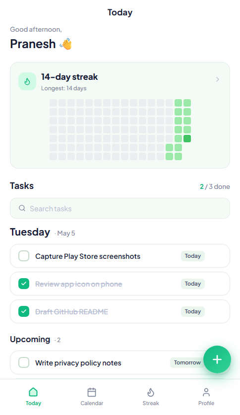
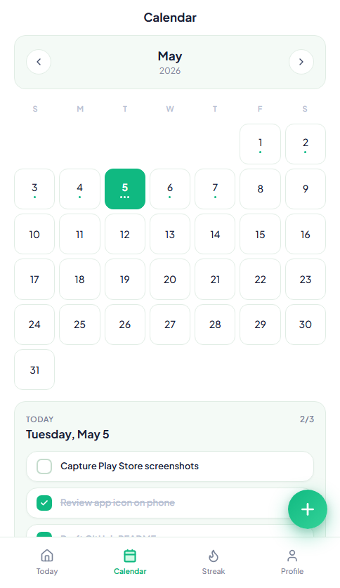
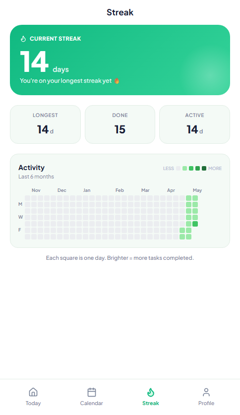
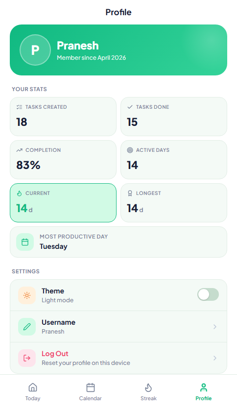

# DoNow

DoNow is a small Android-first todo app I built because I was annoyed with todo apps asking for accounts, subscriptions, and all that extra stuff. I just wanted a simple app where I could add tasks, check them off, and build a GitHub-style activity streak one day at a time, because why not.

The app stores everything on your device with `localStorage`. No backend, no sign-in, no cloud sync.

## Beta Download

The easiest way to try the Android build is from the GitHub Releases page:

[Download the latest beta](https://github.com/Praneshsivasankaran/todo-app/releases/latest)

For direct APK installs, download `DoNow-beta.apk` from the latest release, open it on your Android phone, and allow installation from unknown apps if Android asks. For a clean icon test, uninstall any older DoNow build before installing the new one.

## Screenshots

  
  
  
  

## Features

- Today view with active and completed tasks
- Calendar view for scheduled tasks
- Streak view with a contribution-style heatmap
- Profile stats for completed tasks, active days, and completion rate
- Light and dark theme
- Local-first storage, no account required
- Android wrapper powered by Capacitor

## Tech Stack

- React 18
- Vite
- Tailwind CSS
- Capacitor Android
- lucide-react icons

## Privacy

DoNow keeps task data, username, theme preference, and streak history locally on the device. The current beta does not use a server account or cloud sync.
